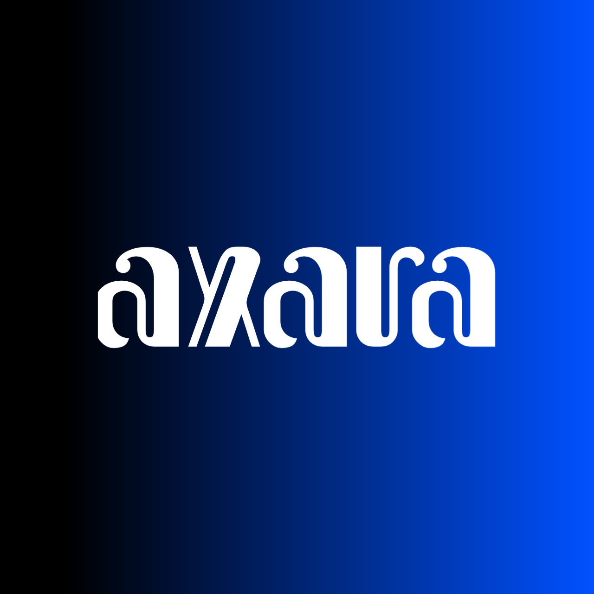

# EONA - Tomorrow Will Be Better

**A Digital Time-Capsule Platform with Geo-Location**

Send your memories across time and space

---

## 🌟 About EONA

EONA is a digital time-capsule platform that combines the power of **time-locking** and **geo-location** to create meaningful memories. Inspired by the word "eon" (a very long period of time), EONA offers a modern and secure way to send your memories across time.

Imagine leaving a message for your future self, or creating a digital time capsule for loved ones that can only be opened at a special moment and special place. With geo-location features, your memories are not just bound by time, but also by places that hold special meaning.

### ✨ Key Features

- **⏰ Time-Locked Capsules** - Set when your memories will unlock
- **📍 Geo-Location Based** - Bind memories to meaningful locations
- **🎨 Multi-Format Support** - Store messages, photos, videos, and audio
- **🔒 Secure & Private** - End-to-end encryption for your private moments
- **💎 Modern Interface** - Intuitive and delightful user experience
- **🌍 Limited Availability** - Annual event with exclusive time slots

---

## 🎯 Why EONA?

- **Meaningful Connections** - Create memories that transcend time and space
- **Perfect for Special Moments** - Birthdays, anniversaries, graduations, and more
- **Nostalgia-Driven** - Ideal for those who cherish memorable experiences
- **Secure by Design** - Your privacy is our priority
- **Community Driven** - Join thousands creating their future memories

---

## 🚀 Getting Started

### Prerequisites

- Modern web browser (Chrome, Firefox, Safari, Edge)
- Internet connection
- Location services enabled (for geo-location features)

### Quick Start

1. Visit [EONA Website](https://eona-mocha.vercel.app/) during the annual period (Dec 25-31)
2. Create your account
3. Create your first time capsule
4. Set the unlock date and location
5. Add your memories (text, photos, videos, audio)
6. Lock it and wait for the magic moment!

---

## 📅 Annual Event Period

EONA operates in **limited annual periods** to create a meaningful ritual:

- **Event Window**: December 25 - 31 (every year)
- **Available Slots**: Maximum 1000 time capsules per year
- **Purpose**: Create a collective moment of reflection and hope

This limited availability makes each capsule special and encourages mindful creation of memories.

---

## 🎨 Features in Detail

### Time-Locked Capsules

Set any future date for your capsule to unlock. It could be:

- A birthday next year
- Your graduation day
- An anniversary milestone
- Your 30th birthday
- Any meaningful date in the future

### Geo-Location Binding

Your capsule can only be opened when you're at a specific location:

- Your first date spot
- Your alma mater
- A memorable vacation destination
- Your childhood home
- Anywhere meaningful to you

### Multi-Format Content

Express yourself fully with:

- **Text Messages** - Write letters to your future self
- **Photos** - Capture the moment visually
- **Videos** - Record video messages
- **Audio** - Save voice notes and songs

### Security & Privacy

- End-to-end encryption
- Secure cloud storage
- Privacy-first design
- No third-party access
- Your data, your control

---

## 💖 Support EONA

EONA is a **free service** from Axara Dev, but you can help ensure it continues every year:

- ⭐ Star this repository
- 🐛 Report bugs and issues
- 💡 Suggest new features
- 💵 Support through our [Trakteer](https://trakteer.id/oortsky/tip)
- 📢 Spread the word

Your support helps maintain infrastructure, security, and development of new features.

---

## 📜 License

This project is licensed under the MIT License - see the [LICENSE](LICENSE) file for details.

---

## 👥 Team

**Axara Dev** - _Creator & Maintainer_

- Email: [axara.dev@proton.me](mailto:axara.dev@proton.me)
- GitHub: [@axara-dev](https://github.com/axara-dev)
- Twitter: [@weareaxara](https://x.com/weareaxara)
- Instagram: [@axara.dev](https://instagram.com/axara.dev)

---

## 🙏 Acknowledgments

- Thanks to all users who believe in making tomorrow better
- Inspired by traditional time capsule practices
- Built with modern web technologies
- Community feedback and support

---

## 📞 Contact & Support

- **Email**: [axara.dev@proton.me](mailto:axara.dev@proton.me)
- **Twitter**: [@weareaxara](https://x.com/weareaxara)
- **Instagram**: [@axara.dev](https://instagram.com/axara.dev)

---

**Tomorrow Will Be Better**

Made with ❤️ by [Axara Dev](https://github.com/axara-dev)

_Because every message you send to the future is a reminder that tomorrow will be better._

---

⭐ **Star us on GitHub** — it motivates us a lot!

